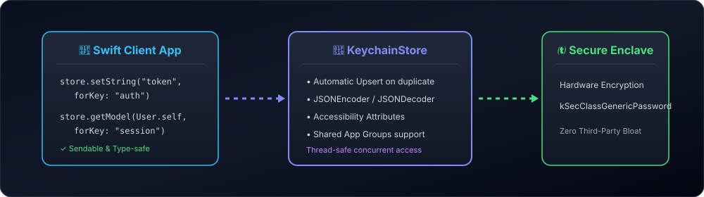

# KeychainStore 🔐

[](https://github.com/nilkanthdesai76/swift-keychain-store/actions)
A lightweight, thread-safe, and `Sendable` Swift wrapper for Apple's Keychain Services on iOS, macOS, watchOS, and tvOS with built-in `Codable` serialization and automatic upserting.

[](https://swift.org)
[](https://developer.apple.com)
[](https://swift.org/package-manager/)
[](LICENSE)

<p align="center">
  
</p>

---

## 🌟 Highlights

- ⚡ **Swift Concurrency Ready**: Conforms to `Sendable` for seamless usage across async tasks, actors, and background queues.
- 🔄 **Automatic Upsert**: Smoothly updates existing keys without throwing `errSecDuplicateItem` errors.
- 📦 **Native Codable Support**: Directly store and retrieve complex structs and data models (`store.setModel(user, forKey: "session")`).
- 🛡️ **Fine-Grained Accessibility**: Easily specify item access policies (`.afterFirstUnlock`, `.whenUnlocked`, `.whenPasscodeSetThisDeviceOnly`).
- 👥 **App Groups Compatible**: Share credentials securely across apps, widgets, and app extensions using `accessGroup`.

---

## 🚀 Installation

Add **KeychainStore** to your dependencies in `Package.swift`:

```swift
dependencies: [
    .package(url: "https://github.com/nilkanthdesai76/swift-keychain-store.git", from: "1.0.0")
]
```

---

## 💻 Quick Start

### 1. Initialize the Store

```swift
import KeychainStore

// Standard store
let keychain = KeychainStore(service: "com.example.myapp")

// Shared App Group store (Widgets, App Extensions)
let sharedKeychain = KeychainStore(
    service: "com.example.myapp",
    accessGroup: "group.com.example.myapp"
)
```

### 2. Save and Retrieve Strings

```swift
// Save or update
try keychain.setString("secure_access_token_xyz", forKey: "user_token")

// Read
if let token = try keychain.getString(forKey: "user_token") {
    print("Found token: \(token)")
}

// Delete
try keychain.delete(forKey: "user_token")
```

### 3. Store Custom Codable Models

```swift
struct AuthSession: Codable {
    let userId: String
    let refreshToken: String
    let expiresAt: Date
}

let session = AuthSession(userId: "usr_102", refreshToken: "ref_abc", expiresAt: Date())

// Persist struct directly
try keychain.setModel(session, forKey: "current_session")

// Retrieve struct directly
if let savedSession = try keychain.getModel(AuthSession.self, forKey: "current_session") {
    print("Logged in as user: \(savedSession.userId)")
}
```

---

## 🧪 Testing

Run tests via the Swift CLI:

```sh
swift test
```

---

## 📄 License

This project is licensed under the MIT License - see the [LICENSE](LICENSE) file for details.
